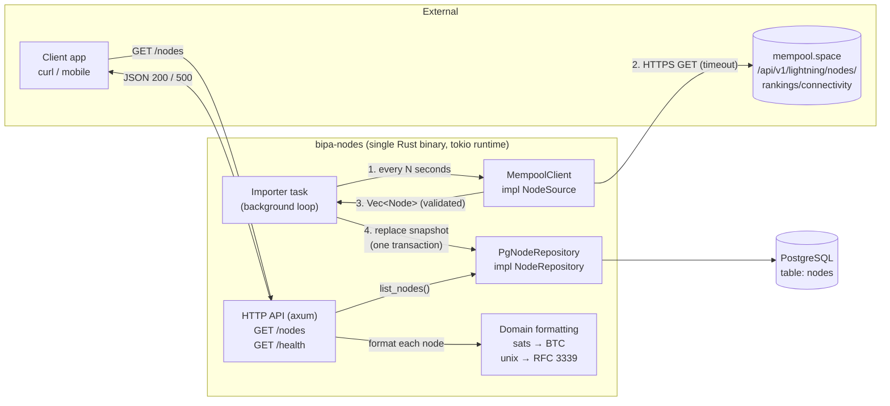
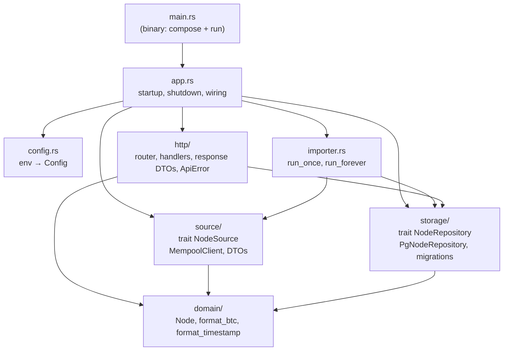
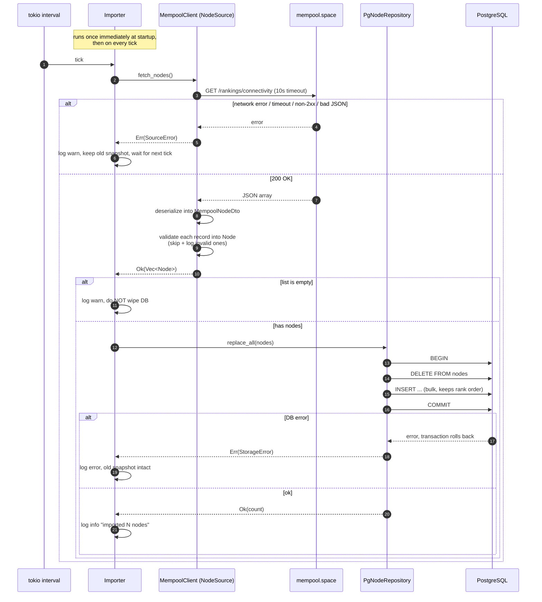
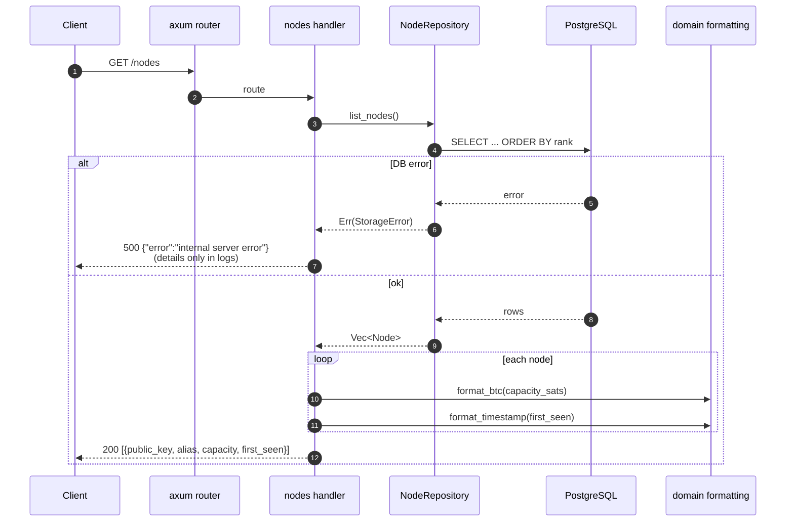
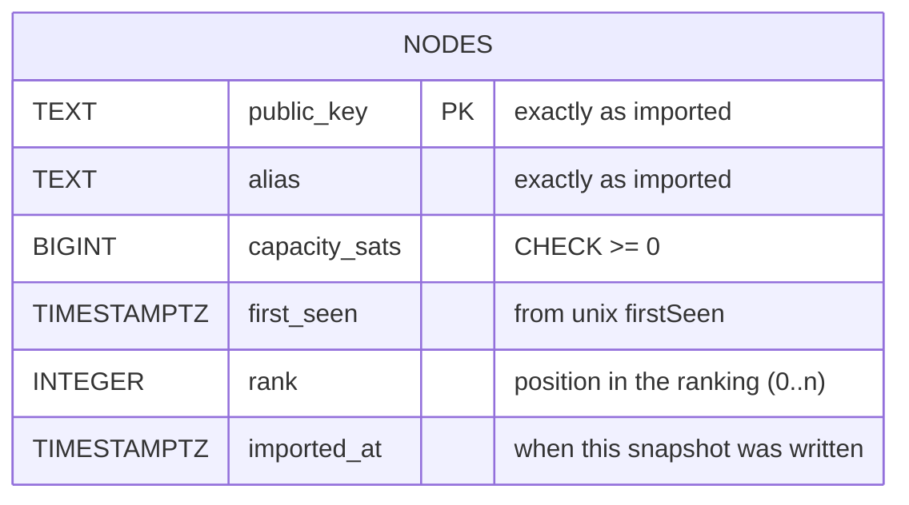
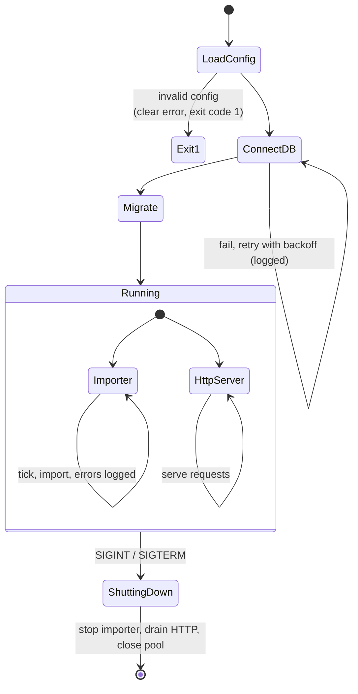
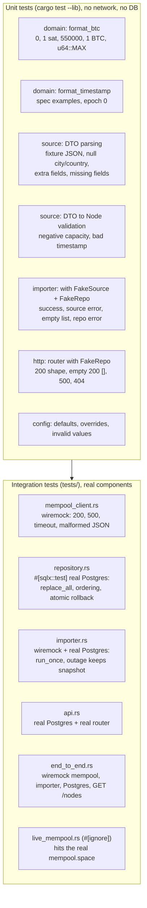
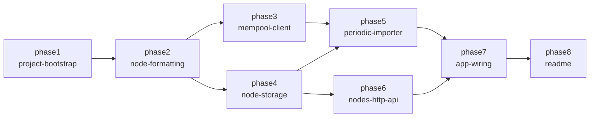

# Architecture

This service imports Lightning Network node rankings from mempool.space on a
schedule, persists them in PostgreSQL, and serves them through a JSON API.

The one rule that shapes everything: **`GET /nodes` never talks to
mempool.space.** The HTTP path only reads the database; a separate background
task is the only thing that writes to it.

---

## 1. Big picture



Two independent flows share only the database:

| Flow | Trigger | Touches mempool.space? | Writes DB? |
|------|---------|------------------------|------------|
| Import | timer (`IMPORT_INTERVAL_SECS`, default 60s), plus once at startup | yes | yes |
| Request | client `GET /nodes` | **no** | no (read only) |

If mempool.space is slow or down, `/nodes` keeps answering with the last
successful snapshot.

---

## 2. Modules (crate layout)

The crate is a **library plus a thin binary**, so integration tests in `tests/`
can build the same components the binary uses.



Dependency rule: **arrows only point towards `domain`**. `domain` depends on
nothing internal. `importer` and `http` depend on the traits (`NodeSource`,
`NodeRepository`), not on reqwest or sqlx. That's what lets us unit-test them
with in-memory fakes.

| Module | Responsibility | Knows about |
|--------|----------------|-------------|
| `domain` | `Node` struct; pure functions to format sats as BTC and timestamps as text | `chrono` only |
| `source` | Calls mempool.space, deserializes JSON, validates each record into a `Node` | `reqwest`, `serde` |
| `storage` | Saves and reads `Node`s in Postgres; owns SQL migrations | `sqlx` |
| `importer` | Runs "fetch, then replace snapshot" on an interval; logs failures and keeps going | traits only |
| `http` | axum router; turns `Node` into the public JSON shape; maps errors to HTTP status codes | trait `NodeRepository`, `domain` |
| `config` | Reads env vars, applies defaults, rejects invalid values | std |
| `app` | Builds everything, runs the importer and HTTP server side by side, shuts down gracefully | everything |

---

## 3. Import flow (write path)



Why these choices:

- **Replace the whole snapshot in one transaction.** The source is a *ranking*
  (top 100 by connectivity), and nodes drop in and out of it. Replacing inside
  one transaction means readers see either the old ranking or the new one,
  never a half-written mix, and nodes that left the ranking disappear.
- **One bad record shouldn't block the rest.** A record with a negative
  capacity or an out-of-range timestamp gets logged and skipped. The other
  99 are still imported.
- **An empty response doesn't count as "zero nodes".** It most likely means
  something went wrong upstream, so we keep the last good data.
- **`MissedTickBehavior::Delay`.** If an import takes longer than the
  interval, we don't fire a burst of catch-up imports.

---

## 4. Request flow (read path)



Response example:

```json
[
  {
    "public_key": "03864ef025fde8fb587d989186ce6a4a186895ee44a926bfc370e2c366597a3f8f",
    "alias": "ACINQ",
    "capacity": "360.10516297",
    "first_seen": "2018-04-05T15:13:42Z"
  }
]
```

- If no import has succeeded yet, the table is empty and the response is
  `200 []`.
- Unknown routes return `404` with a JSON body.
- A panic in a handler is caught by `CatchPanicLayer` and returned as `500`.
  The server keeps running.

---

## 5. Data model

The database stores **raw values** (sats as an integer, timestamp as
`TIMESTAMPTZ`). Formatting happens only at the API edge. That keeps the
data lossless, and the presentation format can change without a migration.



Transformations along the way:

| Field | mempool.space | Domain `Node` | DB column | API output |
|-------|---------------|---------------|-----------|------------|
| public key | `publicKey: string` | `public_key: String` | `TEXT` | `"public_key"`, unchanged |
| alias | `alias: string` | `alias: String` | `TEXT` | `"alias"`, unchanged |
| capacity | `capacity: int` (sats) | `capacity_sats: u64` | `BIGINT` | `"capacity": "360.10516297"` |
| first seen | `firstSeen: int` (unix s) | `first_seen: DateTime<Utc>` | `TIMESTAMPTZ` | `"first_seen": "2018-04-05T15:13:42Z"` |
| order | array index | `rank` (import order) | `INTEGER` | array order |

**sats → BTC** uses integer math only (no `f64`), so there's no rounding error:
`format!("{}.{:08}", sats / 100_000_000, sats % 100_000_000)`.
For example, `550_000` becomes `"0.00550000"` and `36_010_516_297` becomes `"360.10516297"`.

---

## 6. Process lifecycle and "never crash"



How "the server must never crash" is enforced:

1. **No `unwrap`/`expect`/`panic!` in non-test code.** Enforced by clippy lints
   (`unwrap_used`, `expect_used`, `panic` set to `deny`) in `Cargo.toml`.
2. **Typed errors everywhere** (`thiserror`): `ConfigError`, `SourceError`,
   `StorageError`, `ApiError`. Every fallible call returns `Result`.
3. **The importer loop can't die.** Each iteration's error is logged and the
   loop continues. The loop only exits on the shutdown signal.
4. **HTTP errors become responses, not crashes.** `ApiError` implements
   `IntoResponse`, and `CatchPanicLayer` covers anything unexpected.
5. **External calls have timeouts.** A request timeout on reqwest, a connection
   acquire timeout on the pool, and a request timeout layer on axum.
6. **The database being down isn't fatal.** At startup we retry the connection.
   At runtime, `/nodes` returns 500 and the importer logs and retries on the
   next tick.
7. The only intentional exit is a **config error at startup**. Running with a
   wrong config is worse than failing fast with a clear message.

---

## 7. Testing strategy



- **Traits as seams.** `NodeSource` and `NodeRepository` are async traits.
  Unit tests use in-memory fakes; integration tests use the real
  implementations.
- **`#[sqlx::test]`** creates a fresh, isolated database per test and runs the
  migrations, so tests don't interfere with each other.
- **`wiremock`** simulates mempool.space deterministically, including failure
  modes (500s, delays past the timeout, invalid JSON).
- Integration tests need Postgres: `docker compose up -d db`, export
  `DATABASE_URL`, then `cargo test`. There's no CI pipeline. Docker Compose is
  the single entry point for running the stack.

---

## 8. Configuration

| Env var | Default | Meaning |
|---------|---------|---------|
| `DATABASE_URL` | none (required) | Postgres connection string |
| `BIND_ADDR` | `0.0.0.0:3000` | HTTP listen address |
| `MEMPOOL_URL` | `https://mempool.space/api/v1/lightning/nodes/rankings/connectivity` | Source endpoint |
| `IMPORT_INTERVAL_SECS` | `60` | Seconds between imports (must be > 0) |
| `HTTP_CLIENT_TIMEOUT_SECS` | `10` | Timeout for the mempool.space request |
| `RUST_LOG` | `info` | Log filter (`tracing-subscriber`) |

---

## 9. Implementation phases

Each phase is an OpenSpec change, archived under `openspec/changes/archive/`
(the resulting specs are in `openspec/specs/`). Each maps to
one or more logical commits.


